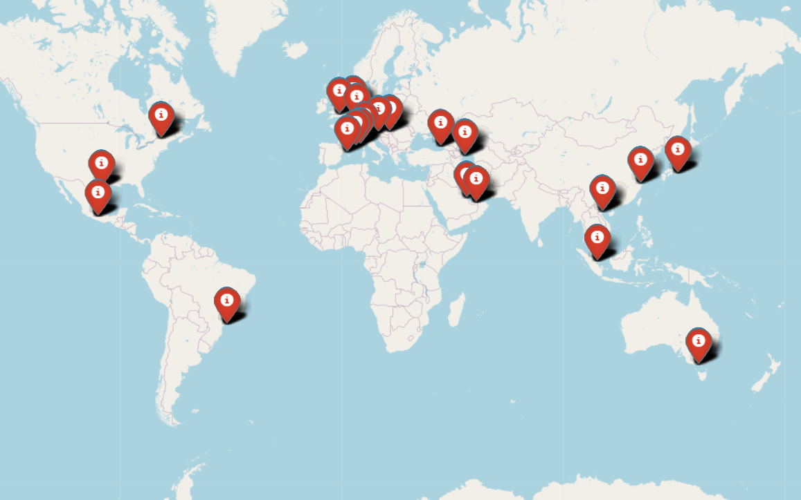

# F1-Calendar

<h2>Introduction</h2>
F1 is the world's most watched and followed motorsports category. A F1 season comprises of almost a dozen and a half races to be held across almost 10 months over different circuits in different countries. The 2020 calendar comprises of 22 races.
In light of recent awarenss about carbon footprint of humans and their activites as a whole, which impacts the planet directly and us indirectly, F1 recently decided to make the sport more "planet-friendly". In 2014, they decided to use hybrid engines which are 50% more efficent than the previous V10s.
In 2019, F1 decided to go one step further. They announced their plans to have net zero carbon footprint by 2030.

<h2>Objective</h2>
Inspired by F1's plans, I tried my hands at solving their fixtures issue. 
 
The 2020 season will go on as follows : 

<ul type="disc">
  <li>Melbourne</li>
  <li>Sakhir</li>
  <li>Hanoi</li>
  <li>Shanghai</li>
  <li>Zandvoort</li>
  <li>Barcelona</li>
  <li>Monaco</li>
  <li>Baku</li>
  <li>Montreal</li>
  <li>Le Castellet</li>
  <li>Spielberg</li>
  <li>Silverstone</li>
  <li>Budapest</li>
  <li>Spa</li>
  <li>Monza</li>
  <li>Singapore</li>
  <li>Sochi</li>
  <li>Suzuka</li>
  <li>Austin</li>
  <li>Mexico City</li>
  <li>Sao Palio</li>
  <li>Abu Dhabi</li>
  </ul>

Enclosed below is an map with the markers denoting the race venues spread across the globe.

 

 

   
Distance covered : 111500 kilometres. That's huge ! For comparison, radius of earth is 6371 kilometres. 
Do you observe how the season begins in Australia, goes to Middle-East in Bahrain, then again goes in the opposite direction to Vietnam in Asia, then Shangai and then Netherlands only to return to Asia again 10 rounds later ! 
This is an attempt to create an optimized F1 calendar to cut down unecessary travelling back and forth between continents during a F1 season. 

<h2>Technologies/Languages</h2>
<ul type="disc">
  <li>Python</li>
  <li><a href="https://developers.google.com/optimization" target="_blank">Google OR-Tools</a></li>
  </ul>

<h2>Conclusions</h2>
Personally, I was bewildered by the solutions I got from this program. They seemed too good to be true !   
Such a schedule mightn't make a mammoth difference, but definitely would be a good step in the right direction. The optimized calendar turns out to be :  
<ul type="disc">
<li>Melbourne</li>
<li>Singapore</li>
<li>Hanoi</li>
<li>Shangai</li>
<li>Suzuka</li>
<li>Abu Dhabi</li>
<li>Sakhir</li>
<li>Baku</li>
<li>Sochi</li>
<li>Budapest</li>
<li>Spielberg</li>
<li>Monza</li>
<li>Monaco</li>
<li>Le Castellet</li>
<li>Barcelona</li>
<li>Spa</li>
<li>Zandvoort</li>
<li>Silverstone</li>
<li>Montreal</li>
<li>Austin</li>
<li>Mexico</li>
<li>Sao Paulo</li>
  </ul>
   
( Yeah, Abu Dhabi won't be the season fnale. It's not the most popular among us anyway. Brazil will get to host the finale and it does produce brilliant races. So, no issues there. ) 
Distance covered : 43703 kilometres
<b><i>That's a 60% decrease in distance covered compared to the original schedule.</i></b> 
 

<i>This is a work in progress. F1 is a huge sport with huge logistical headaches. It's not just about 20 cars racing in circles. There is a lot to consider in terms of marketing, gaining the biggest crowd possible during the events, planning to avoid extreme weather conditions and many other parameters which us, the fans don't even know about.</i>
  

